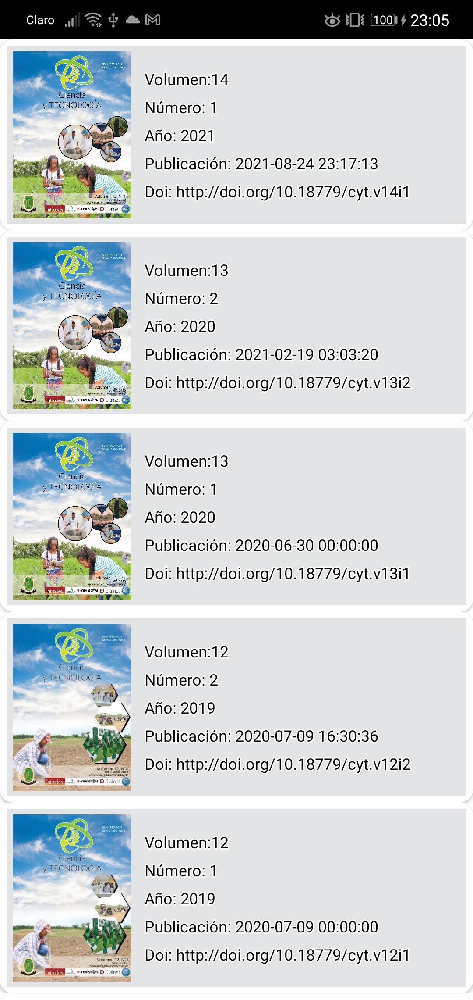
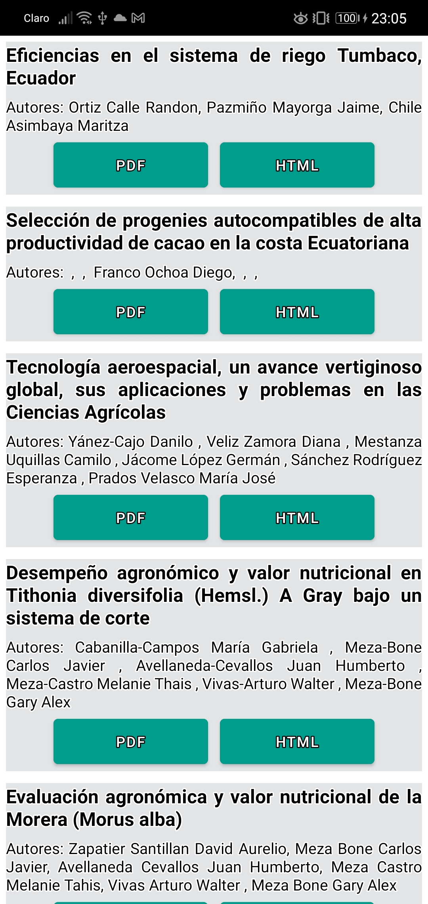
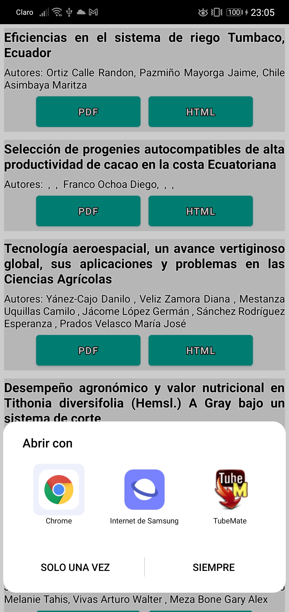
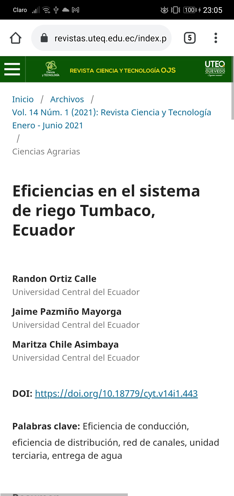

# examen-movil
<h1>EXAMEN “PROGRAMACIÓN ORIENTADA A OBJETOS PARA DISPOSITIVOS MÓVILES”</h1>
cuando se abre la aplicación se carga las rvistas 

El usuario da click en cualquier revista y posteriormente saldrá los Volúmenes publicados de esa revista 

El usuario da click en cualquier edición publicada y se muestra los artículos de esa edición 
 
El usuario da click en la opción HTML y se abre el navegador para visualizar la página de donde proviene el archivo 
 
 
